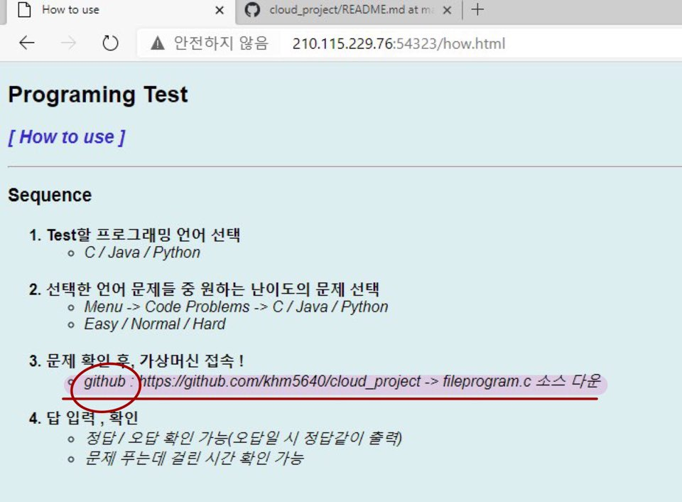

# 코딩 테스트 프로그램

 

## A.	프로젝트 명
### AWS Ec2와 Ubuntu 가상서버를 이용하여 코딩테스트 프로그램 & 웹 구현

***

## B.	프로젝트 멤버 이름 및 멤버 별로 담당한 파트에 대한 소개
- 송기룡 : Aws Ec2 인스턴스에서 코딩 테스트 프로그램 구현
- 김혜민 : Ubuntu 가상서버에서 웹 페이지 구현

***

## C.	프로젝트 소개 및 개발 내용 소개

### <프로젝트 소개>
#### ubuntu와 aws ec2를 이용한 코딩테스트 프로그램을 구현해보았습니다.   웹에서 클라이언트가 문제를 확인한 후, ec2 인스턴스에서 .c 파일을 통해 답을 입력하면 결과를 알려주는 프로그램 입니다.

### <개발 내용>
### [Ubuntu 가상서버] - 코딩 테스트 웹 구현
#### 1. docker 설치 & 컨테이너 구동
- sudo su - 

	`// root로 이동 ( docker는 root권한이 있어야 실행 O )`

- curl -fsSL https://get.docker.com/ | sudo sh
- docker version 

	`// 설치 여부 확인`

- Nginx 이미지로 컨테이너 실행

	`// docker image pull nginx`

	`// docker container run -d -p 12345:80 nginx`

- docker container ls 

	`// 컨테이너 상태 확인`

- mkdir /home/sp~/workspace_docker/www/ 
- index.html 작성
- host pc 웹 페이지 저장 디렉토리 
<-> Nginx 디렉토리 

	`// docker container run -v $PWD:/usr/share/nginx/html -d -p 54323:80 nginx`

#### 2. 웹 구현시 필요한 <.html> 코드 작성

### [AWS EC2] - 코딩 테스트 정답 확인 프로그램 구현
#### 1. AWS 인스턴스 생성
#### 2. putty -> SSH연결
#### - 프라이빗 키 설정
- .pem -> .ppk 
	
	`//puttygen 이용`

#### - 패키지 설치
- gcc
	`//  apt-get update`

	`// apt-get install gcc`

#### 3. 코딩 테스트 정답 확인 프로그램 코드 작성
#### - cloud_p.c

***
## D.	프로젝트 개발 결과물 소개 
- 웹 사이트를 pc 또는 phone으로 접속가능하므로, 클라이언트는 ip 주소만 알면 문제를 확인 가능합니다. 
- aws ec2 인스턴스는 private key로 연결이 가능하므로, github에 오픈소스로 .c파일을 올려줍니다. 클라이언트는 github주소를 통해 .c파일을 얻고, 각자 test 할 수 있습니다.

### <다이어그램>

***

## E.	개발 결과물을 사용하는 방법 소개 
1. 제공된 ip주소를 통해 웹에 접속
- ip주소 : http://210.115.229.76:54323  
	- PC	
	
	
	
	- PHONE
	
	

1. 원하는 언어 / 난이도의 코딩 문제들을 확인 
	- PC	

	
	

	- PHONE
	
	

1. 웹에 적힌 github주소를 통해 정답확인 프로그램 파일(cloud_p.c) 소스를 제공 받음 

	

1. 프로그램 파일의 컴파일을 통해 각자 test를 진행
	- 실행 result 
	`-> 걸린시간 , 정답 / 오답 출력`

	

***
## F.	개발 결과물의 필요성 및 활용방안

- 개인 코딩 공부 및 학생들에게 과제를 내줄 때도 사용할 수 있습니다.  
이 프로그램으로 개발자 및 코딩공부가 필요한 사람들이 코딩공부를 쉽고 효율적으로 할 수 있고, 개개인의 코딩 실력을 테스트할 수 있습니다.

